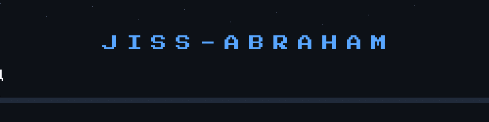

<div align="center">



<br>


</div>

---

<div align="center">
## 👋 Hi / നമസ്തേ

<div align="center">

### I'm **Jiss Abraham**

**Computer Science Student · Data Analytics · AI · Developer · Designer**

</div>

I'm a passionate Computer Science student from **India**, currently pursuing **MSc Computer Science (Data Analytics)**.

I enjoy turning ideas into working projects — from software and data analysis to **AI, computer vision, automation, and digital design**.

---

## 🧑‍💻 About Me

```text
🎓 MSc Computer Science — Data Analytics
💻 Software Development
📊 Data Analytics
🤖 Artificial Intelligence
👁️ Computer Vision
🎨 UI/UX & Digital Design
⚡ Automation & Embedded Systems
🌱 Always Learning & Building
```

### 🔭 Currently Working On

* 📊 Data Analytics & Visualization
* 🤖 AI & Computer Vision
* 🌱 Smart agriculture technology
* 💻 Software development
* 🗄️ Database systems
* 🎨 UI/UX and digital design

---

## 🚀 Featured Project

<div align="center">

# 🌱 NovaKin

### AI-powered plant disease detection & targeted spraying system

</div>

**NovaKin** is a smartphone-assisted system that uses AI to estimate plant infection severity and convert it into a targeted spray prescription.

The system combines:

```text
📱 Smartphone
      ↓
🤖 AI / Computer Vision
      ↓
🌿 Disease & Severity Detection
      ↓
📋 Spray Prescription
      ↓
⚡ ESP32 Controlled Sprayer
      ↓
🎯 Targeted Treatment
```

**Technologies:**

`Python` `AI` `Computer Vision` `ESP32` `IoT` `Automation`

---

## 🛠️ Tech Stack

### 👨‍💻 Programming Languages

<p align="left">

</p>

### 🌐 Web Development

<p align="left">

</p>

### 📊 Data & Databases

<p align="left">


</p>

### 🎨 Design

<p align="left">

</p>

### 🐧 Platforms & Tools

<p align="left">

</p>

---

## 📚 Currently Learning

<div align="center">

| Area | Focus                   |
| :--: | :---------------------- |
|  📊  | Data Analytics          |
|  🤖  | Artificial Intelligence |
|  👁️ | Computer Vision         |
|  🐍  | Python                  |
|  🗄️ | SQL & Databases         |
|  🌐  | Web Development         |
|   ⚡  | Embedded Systems        |
|  🎨  | UI/UX                   |

</div>

---

## 📊 GitHub Statistics

<div align="center">


</div>

<br>

<div align="center">


</div>

---

## 🐍 My Contributions

<div align="center">


</div>

---

## 🌐 Find Me Online

<div align="center">

<a href="https://www.linkedin.com/in/jiss-abraham-1b7b701a3">

</a>

<a href="https://kaggle.com/jissxabraham">

</a>

<a href="https://www.behance.net/jissabraham35">

</a>

<a href="https://medium.com/@jissabrahm35">

</a>

<br><br>

<a href="https://instagram.com/jiss_abrahm">

</a>

<a href="https://stackoverflow.com/users/20248837/jiss-abraham">

</a>

</div>

---

## 📫 Contact

<div align="center">

### Let's build something interesting together.

📧 **[jissabraham35@gmail.com](mailto:jissabraham35@gmail.com)**

</div>

---

<div align="center">

### 💭

**Build · Learn · Experiment · Repeat**

<br>

⭐ *Thanks for visiting my profile!*

</div>
