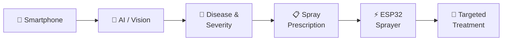

  <picture>
    <source media="(prefers-color-scheme: dark)"  srcset="./assets/plin.gif">
    <source media="(prefers-color-scheme: light)" srcset="./assets/light.gif">
    
  </picture>

  

    

  
  &nbsp;&nbsp;&nbsp;
  
  &nbsp;&nbsp;&nbsp;
  
  &nbsp;&nbsp;&nbsp;
  
  &nbsp;&nbsp;&nbsp;
  
  &nbsp;&nbsp;&nbsp;
  
  &nbsp;&nbsp;&nbsp;
  

    

  

 

# 👋 Hi, I'm Jiss

## MSc Computer Science · Data Analytics

### I turn ideas into working projects, from data analysis and software to **AI, computer vision, automation and digital design**.

 

## 🔭 Currently Working On

  
  
  
  
  

 

## 📚 Currently Learning

  
  
  
  
  

---

## 🚀 Featured Project

<table>
  <tr>
    <td>

### 🌱 NovaKin
**AI-powered plant disease detection & targeted spraying**

A smartphone-assisted system that uses AI to estimate plant infection severity and turns it into a targeted spray prescription, so only the affected plants get treated.

```mermaid
flowchart LR
    A["📱 Smartphone"] --> B["🤖 AI / Vision"]
    B --> C["🌿 Disease &<br/>Severity"]
    C --> D["📋 Spray<br/>Prescription"]
    D --> E["⚡ ESP32<br/>Sprayer"]
    E --> F["🎯 Targeted<br/>Treatment"]
```

</td>
  </tr>
</table>

---

## ⚡ Tech Stack

 

  
  &nbsp;&nbsp;&nbsp;&nbsp;
  
  &nbsp;&nbsp;&nbsp;&nbsp;
  

 

  
  &nbsp;&nbsp;&nbsp;&nbsp;
  
  &nbsp;&nbsp;&nbsp;&nbsp;
  

 

  
  &nbsp;&nbsp;&nbsp;&nbsp;
  
  &nbsp;&nbsp;&nbsp;&nbsp;
  

 

  
  &nbsp;&nbsp;&nbsp;&nbsp;
  
  &nbsp;&nbsp;&nbsp;&nbsp;
  

 

  
  &nbsp;&nbsp;&nbsp;&nbsp;
  
  &nbsp;&nbsp;&nbsp;&nbsp;
  
  &nbsp;&nbsp;&nbsp;&nbsp;
  
  &nbsp;&nbsp;&nbsp;&nbsp;
  

 

---

## 📊 GitHub Stats

  
  
   
  

<b>🐍 Contribution snake</b>

 

  

---

## 📫 Let's Connect

**Got an idea, a project or a dataset? Let's build something interesting together.**

📧 [jissabraham35@gmail.com](mailto:jissabraham35@gmail.com)

 

`Build` · `Learn` · `Experiment` · `Repeat`

⭐ Thanks for visiting my profile!

